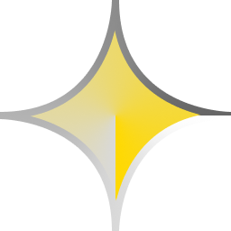

    <h1>Hello, GitHub!</h1>
    <table width="100%">
        <td align="left"></td>
        <td align="right"><h3>Меня зовут ntcd_lol, я русский начинающий разработчик которому всего 13 лет.</h3></td>
    </table>

## Мои проекты

### Готовые

+ [PSE SDK Lua](https://github.com/ntcd-lol/pse-lua) - Проект по переносу [PSE SDK (Made by RootTool0)](https://github.com/RootTool0/pse-sdk) с сырых пакетов в C++ на удобный Fluent API Lua. (v0.1)

### В разработке

+ N - Гибкий язык программирования на базе С++26.

+ SolverCore - Движок игр на C++, SDL3 и Vulkan.

### В обдумывании

+ Qempress - Проект по сжатию неиросетей необячным способом в блоки графов (Q-Block).

+ Lamp - Неиросеть базированная на своей собственной архитектуре.

---

## Всем доброго дня и исследований!

<!-- P.S. если это читает RootTool0, иди лесом со своими пасхалками в документации. -->